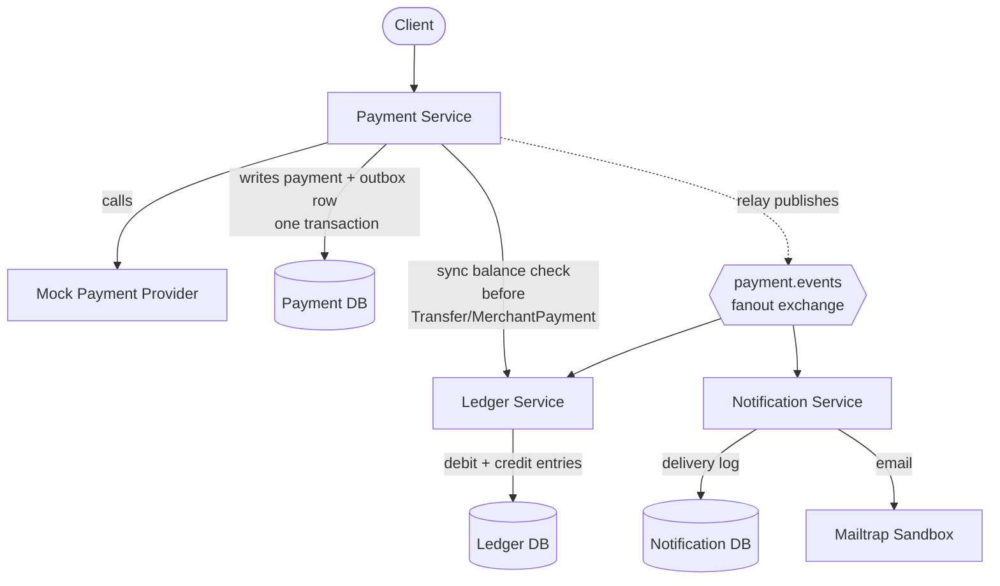
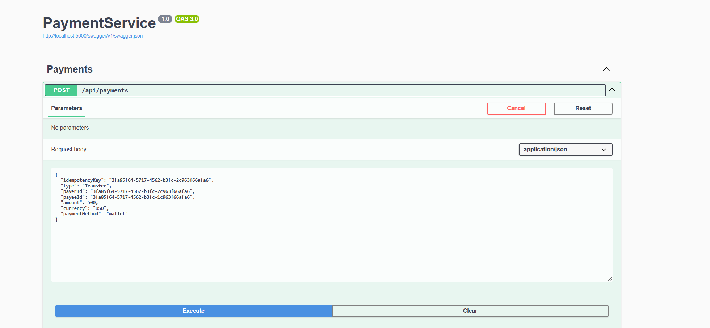
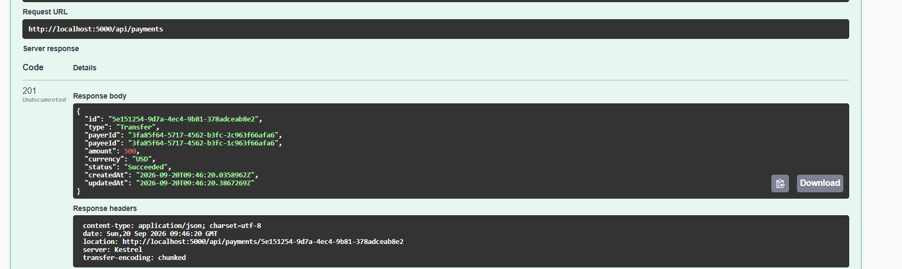
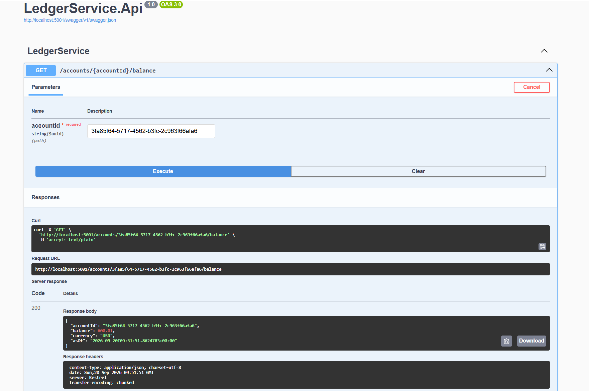
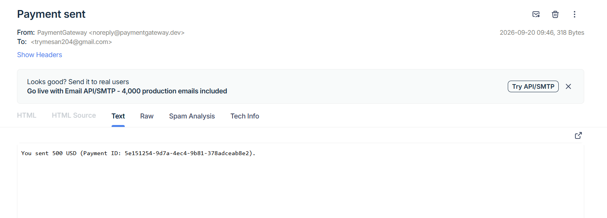
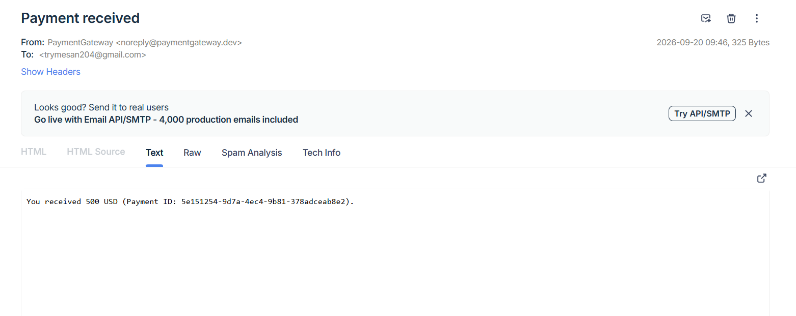
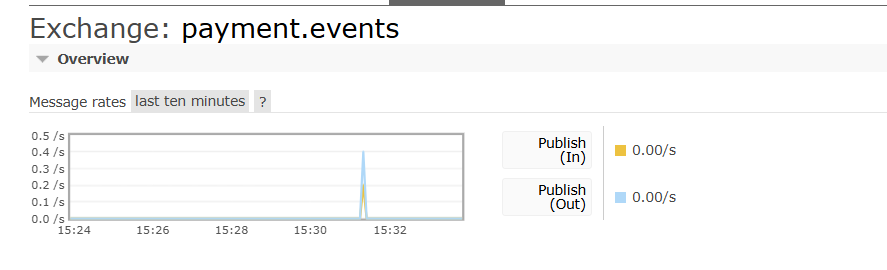
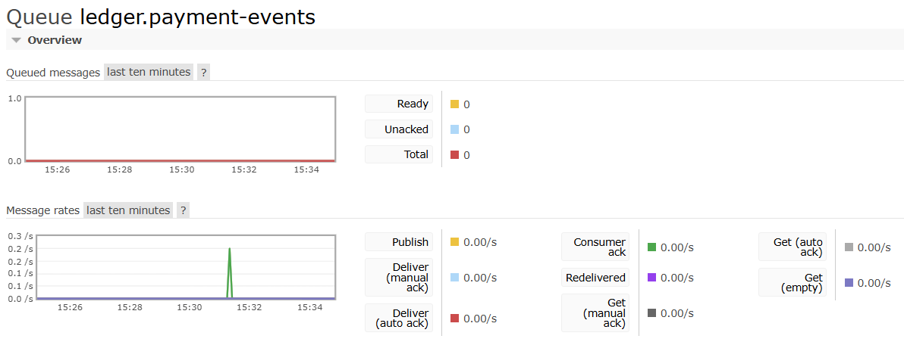
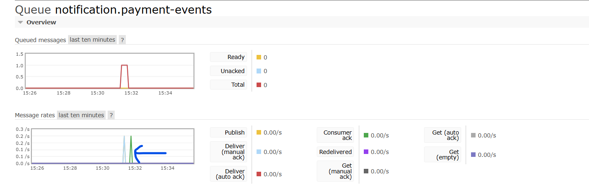

# PaymentGateway

A microservices-based payment platform built to demonstrate event-driven architecture, double-entry bookkeeping, and reliability patterns used in real payment systems — built with **.NET 10**, **PostgreSQL**, **RabbitMQ**, and **Docker**.

This is not a payment processor itself — it's the orchestration and ledger layer a fintech app or wallet would build *around* a real payment processor (Stripe, Fonepay, ConnectIPS, etc.), which is mocked here to focus on the architecture.

---

## Architecture



Every payment produces **exactly one debit and one credit** ledger entry (double-entry bookkeeping). A `TopUp` debits a system suspense account (representing funds entering from outside the platform); a `Transfer` or `MerchantPayment` debits the payer's own account.

---

## Services

| Service | Responsibility | Owns |
|---|---|---|
| **Payment Service** | Accepts payment requests, calls the (mocked) external provider, publishes outcomes | `payments`, `outbox_messages` |
| **Ledger Service** | Consumes payment events, maintains double-entry balances and transaction history | `ledger_entries`, `processed_events` |
| **Notification Service** | Consumes payment events, emails payer and payee via Mailtrap | `notification_logs`, `processed_events` |
| **API Gateway** *(planned)* | Single entry point, JWT auth, rate limiting, routing | — |

Each service has its own database, own solution (`.sln`), and is independently deployable. A root `PaymentGateway.sln` and root `docker-compose.yml` bring everything together for local development.

---

## Key patterns demonstrated

**Idempotent payment intake** — every `POST /payments` requires a client-supplied `idempotencyKey`, enforced by a DB unique constraint (not just an application-level check), so retries and concurrent duplicate submissions never double-process a payment.

**Transactional outbox** — Payment Service never publishes directly to RabbitMQ. It writes the payment update and an outbox row in one DB transaction, and a background relay (`OutboxRelayService`) polls and publishes from there — eliminating the dual-write problem between the database and the message broker.

**Idempotent consumers** — RabbitMQ guarantees at-least-once delivery, not exactly-once. Both Ledger and Notification check a `processed_events` table (keyed on the event's own ID) before doing any work, so redelivered messages are safely no-ops.

**Fanout pub/sub** — Payment Service publishes one event to a `fanout` exchange; Ledger and Notification each bind their own independent queue to it. Payment Service has zero knowledge of who's listening — adding a fourth consumer requires no changes upstream.

**Double-entry bookkeeping** — balances are never stored as a single mutable field. Every transaction produces a debit entry and a credit entry that sum to zero, with a running `BalanceAfter` snapshot — an append-only, auditable ledger, not a number that gets overwritten.

**Synchronous balance check with a documented tradeoff** — Payment Service calls Ledger's `GET /accounts/{id}/balance` before allowing a `Transfer`/`MerchantPayment` to proceed. This has a known check-then-act race condition under true concurrency (see Known Limitations).

---

## Tech stack

- **.NET 10** / ASP.NET Core Web API
- **PostgreSQL 16** — one database per service
- **RabbitMQ 3** (management image) — fanout exchange, manual ack/nack
- **Serilog** — structured logging, console + rolling file sinks
- **MailKit** + **Mailtrap** (sandbox) — notification delivery
- **xUnit** — idempotency and validation tests
- **Docker Compose** — full local orchestration

---

## Running it locally

```bash
git clone https://github.com/trymesan204/PaymentGateway.git
cd PaymentGateway
docker compose up --build
```

This starts all three services, their databases, and RabbitMQ, fully networked. Swagger is available per service:

| Service | Swagger | RabbitMQ Management |
|---|---|---|
| Payment | http://localhost:5000/swagger | http://localhost:15672 (guest/guest) |
| Ledger | http://localhost:5001/swagger | |
| Notification | http://localhost:5002/swagger | |

Open `PaymentGateway.sln` at the repo root to see every project in one Visual Studio window.

### Demo flow

1. `POST /payments` on Payment Service with `type: "TopUp"` — tops up an account from the system suspense account
2. `GET /accounts/{accountId}/balance` on Ledger Service — confirm the balance increased
3. `POST /payments` with `type: "Transfer"` from that account to another

   

   

4. `GET /accounts/{accountId}/balance` on both accounts — confirm one decreased, one increased

   

5. Check Mailtrap's sandbox inbox — both payer and payee should have received an email

   
   

6. Check RabbitMQ's management UI (`payment.events` exchange) to see message throughput

   

   

   

---

## API reference

### Payment Service
- `POST /payments` — create a payment (`TopUp`, `Transfer`, or `MerchantPayment`)
- `GET /payments/{id}` — check a payment's status

### Ledger Service (read-only — writes only happen via the event consumer)
- `GET /accounts/{accountId}/balance`
- `GET /accounts/{accountId}/entries` — paginated transaction history
- `GET /payments/{paymentId}/entries` — both entries (debit + credit) for one payment
- `POST /dev/seed-balance` — **development only**, credits an account directly for testing (returns 404 outside `Development`)

### Notification Service
- `GET /payments/{paymentId}/notifications` — notification log for a payment

---

## Known limitations

These are intentional scoping decisions, not oversights — each has a real-world fix that was deliberately left out to keep the project focused.

| Limitation | Why it exists | What a production fix looks like |
|---|---|---|
| No authentication yet | API Gateway (Milestone 4) not yet built | JWT validation at the gateway; `PayerId` extracted from token claims, not client input |
| Balance check has a check-then-act race | Simple synchronous HTTP call, no reservation | A hold/reservation pattern — atomically reserve funds at check time, confirm or release later |
| `Pending` payments (provider timeout) never resolve | No reconciliation job built | A scheduled job that re-queries the provider or expires stale `Pending` payments |
| No dead-letter queue | Kept RabbitMQ config simple for this scope | `x-dead-letter-exchange` on queue declaration, routing repeatedly-failing messages to a DLQ for manual inspection |
| Notification emails use fake addresses (`{accountId}@example.com`) | No User/Identity service in scope | A real User Service resolving `AccountId → email` |
| No real payment processor integration | Out of scope — focus is the internal architecture | Swap `IPaymentProvider`'s mock implementation for a real Fonepay/Stripe adapter; add webhook handling for async provider callbacks |
| User accounts are not modeled | Out of scope — users referenced by opaque `Guid` only | A dedicated Identity/User service, or JWT `sub` claim as the account identifier |

---

## Roadmap

- [ ] API Gateway with JWT authentication and rate limiting (YARP)
- [ ] Reservation/hold pattern for balance checks
- [ ] Dead-letter queue for poison messages
- [ ] Reconciliation job for stuck `Pending` payments
- [ ] Tests for Ledger and Notification idempotent consumers

---

## Project structure

```
PaymentGateway/
├── PaymentGateway.sln
├── docker-compose.yml
├── services/
│   ├── PaymentService/     (Api, Domain, Infrastructure, Tests)
│   ├── LedgerService/      (Api, Domain, Infrastructure, Tests)
│   └── NotificationService/(Api, Domain, Infrastructure, Tests)
└── shared/
    └── PaymentGateway.Contracts/   (shared event contracts)
```
